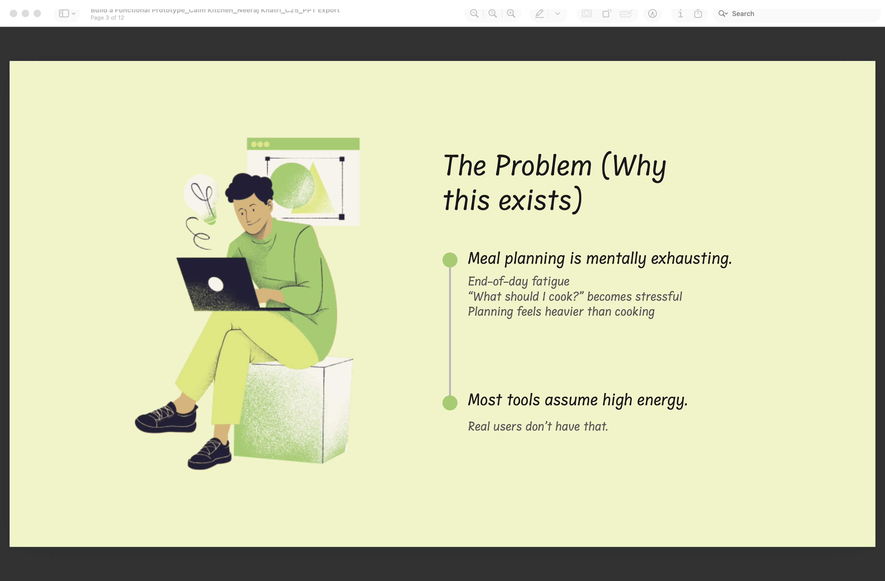

# Reducing Decision Fatigue Through UX Design

Many everyday decisions fail not due to lack of options, but due to cognitive overload.  
This UX exploration focuses on how product design can reduce decision fatigue, emotional friction, and anxiety in recurring choice-heavy scenarios.

The work emphasises clarity, constraint-setting, and trust over feature density.

---

## Context

Meal planning is often positioned as a productivity problem, but in reality it is an **emotional and cognitive load problem**.

This UX-focused case explores how design can reduce friction, overwhelm, and decision fatigue in everyday planning tasks.

---

## The Problem

Users struggle with meal planning due to:
- Too many choices
- Repetitive decision-making
- Guilt associated with unhealthy or inconsistent habits
- Cognitive overload rather than lack of tools

Most solutions optimise for features, not emotional ease.

---

## Key Insight

Meal planning should feel:
- Calm
- Reassuring
- Non-judgemental
- Flexible

Reducing stress is more valuable than increasing control.

---

## Design Direction

The experience was designed to:
- Minimise choices per interaction
- Reduce visual noise
- Support gradual commitment
- Emphasise progress over perfection

Low-fidelity and interactive prototypes were used to validate flow and intent rather than visual polish.

## System Flow

---

## Learnings

- UX success is often about what you remove
- Emotional friction is as real as functional friction
- Calm design can be a differentiator
- Not all products need to optimise for speed

---

*This case study was developed as part of UX exploration and prototyping practice, focusing on decision fatigue and behavioural design.*
